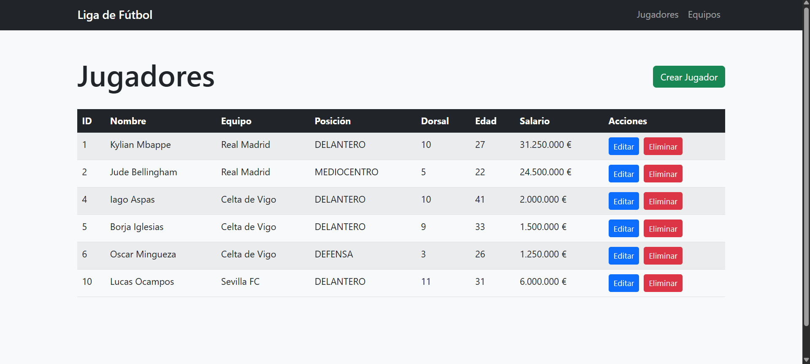
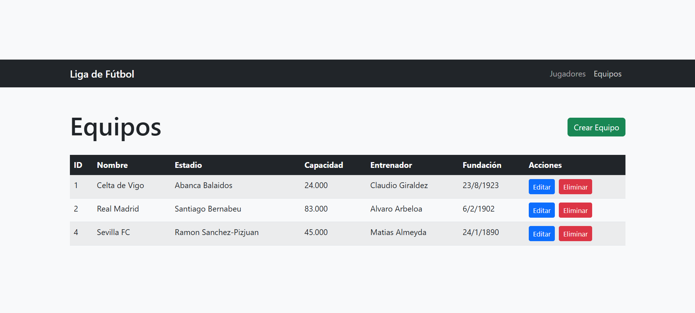
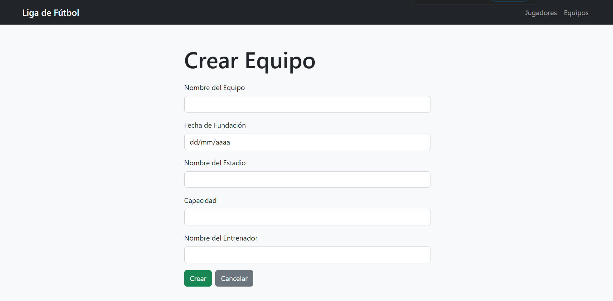

# API Rest Liga española con React

Tras hacer una API Rest usando una plantilla de thymeleaf me propuse ampliar mis conocimientos en front por lo que he estado estas ultimas semanas aprendiendo un framework de Front; React, esta es solo la parte de backend, el front se encuentra disponible en el repositorio: (https://github.com/JaviMP-03/API_Liga_React)

## Tecnologías

- Spring Boot
- React 18
- TypeScript
- Vite
- React Router
- Bootstrap 5

### Lista de jugadores

### Lista de equipos

### Formulario de edición

